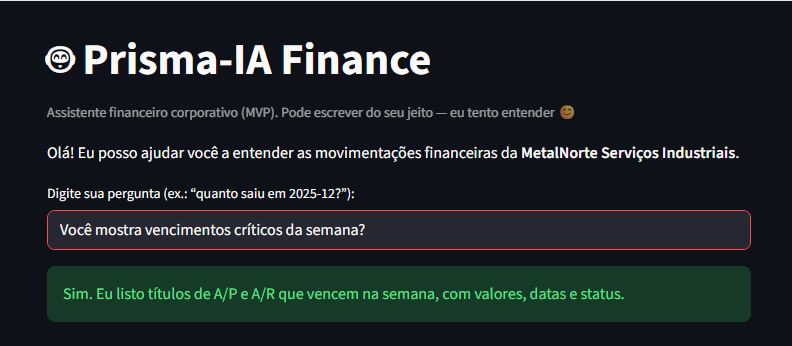
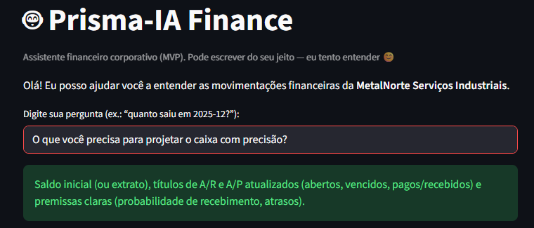
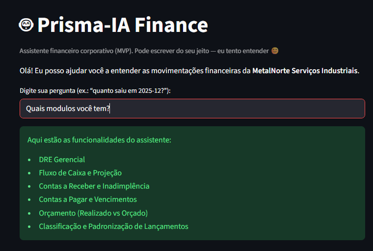

Evidências visuais do protótipo (Prisma-IA Finance)

As imagens abaixo registram o funcionamento real do protótipo Prisma-IA Finance (MVP) em execução via Streamlit. Elas servem como comprovação visual do comportamento do agente e facilitam a avaliação por professores, recrutadores e revisores, mostrando que o projeto está operacional e integrado à base de dados mockada em data/.

✅ Imagem 1 — Resposta válida com base na base de conhecimento (FAQ)

Nesta captura, o usuário pergunta: “O que você precisa para projetar o caixa com precisão?”
O agente responde com uma explicação objetiva e alinhada ao domínio financeiro, citando elementos necessários como saldo inicial/extrato, títulos de A/R e A/P atualizados e premissas operacionais.
Isso comprova que o agente consegue interpretar perguntas do mundo real e responder de forma útil com base em conhecimento estruturado (FAQ / regras do projeto).

✅ Imagem 2 — Listagem de funcionalidades do agente (módulos)

Aqui, o usuário pergunta: “Quais módulos você tem?”
O agente retorna uma lista clara das funcionalidades disponíveis, como DRE Gerencial, Fluxo de Caixa e Projeção, Contas a Receber/Inadimplência, Contas a Pagar/Vencimentos, Orçamento e Classificação de lançamentos.
Esta evidência valida que o protótipo oferece uma navegação simples para qualquer pessoa entender o que o agente cobre e quais são os recursos previstos no roadmap.

✅ Imagem 3 — Resposta afirmativa sobre rotina financeira (vencimentos críticos)

Nesta captura, o usuário pergunta: “Você mostra vencimentos críticos da semana?”
O agente responde confirmando a capacidade e descrevendo a saída esperada (títulos com valores, datas e status).
Mesmo que parte dessas funcionalidades esteja prevista para evolução do dataset, a imagem é útil para demonstrar a intenção do produto, o alinhamento com o caso de uso corporativo e a consistência do comportamento do agente.

Observação de qualidade e confiabilidade

O protótipo segue uma regra central do projeto: não inventar números.
Quando uma resposta depende de valores (ex.: entradas/saídas por mês), o agente utiliza os dados disponíveis em data/transacoes.csv.
Quando o assunto está fora do escopo (ex.: previsão do tempo), o agente deve recusar com educação e redirecionar para temas financeiros suportados.
